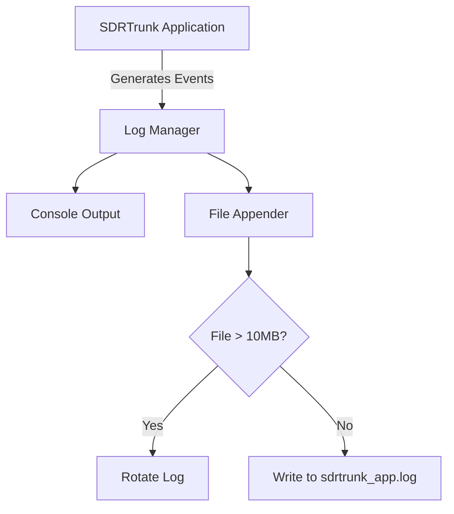

## Goal
Learn how to manage, view, and rotate system logs to troubleshoot SDRTrunk effectively.

## Step-by-Step Configuration
1. Open the **User Preferences** panel from the main toolbar.
2. Navigate to the **Advanced & System** tab.
3. Select **Diagnostics** to access the logging configuration.
4. Set your desired **Log Level** (e.g., INFO, DEBUG, TRACE) from the dropdown menu.
5. Click **View Logs** to open the current log file in your default text editor, or click **Log Directory** to browse rotated historical logs.

## Log Flow Overview

## System Logs Components
| Component | Function |
|---|---|
| **View Logs** | Opens the current application log in your default text editor. |
| **Log Directory** | Opens the folder containing all rotated and current system logs. |
| **Log Level Dropdown** | Filters the verbosity of logs (INFO, DEBUG, TRACE, WARN, ERROR). |
