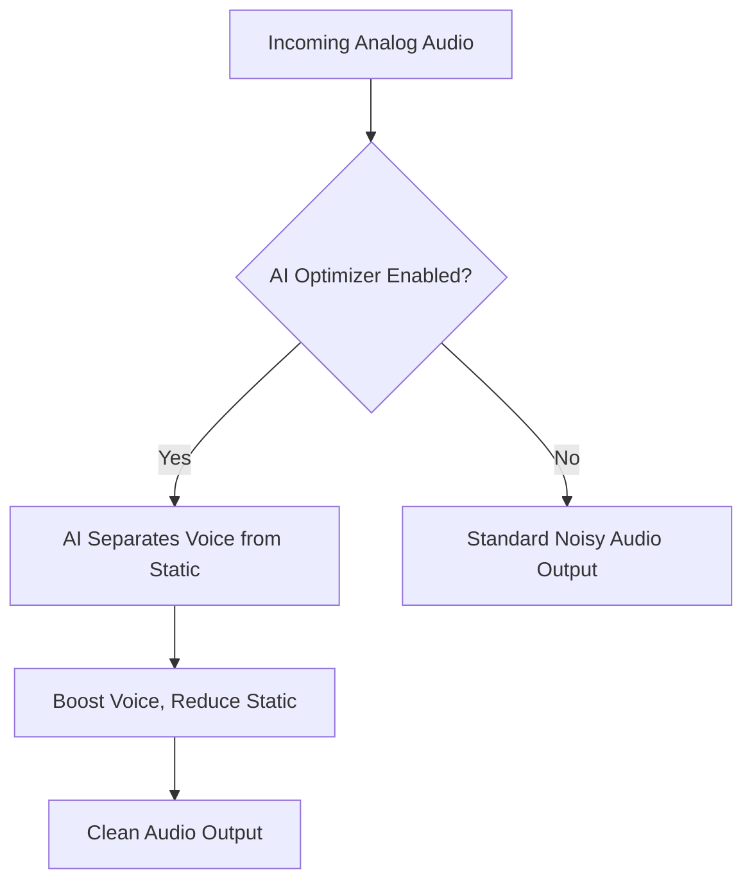

## Goal
The **NBFM AI Audio Optimizer** cleans up fuzzy, static-filled analog radio calls using AI.

# NBFM AI Audio Optimizer

Digital radio systems (like P25) usually sound crystal clear. But older, traditional analog systems (NBFM) often suffer from annoying static, hums, and hisses, especially if the person talking is far away.

The **NBFM AI Audio Optimizer** acts like an intelligent audio engineer, cleaning up the sound before it reaches your ears.

## Step-by-Step

1. Open the **Playlist Editor**.
2. Select your Analog (NBFM) channel.
3. Look for the **Audio Processing** section.
4. Check the box to enable the **NBFM AI Audio Optimizer**.

### Workflow Benefit

## Component Map

* **NBFM AI Audio Optimizer Checkbox:** Toggles the AI audio cleaning algorithm on or off for the selected channel.

> **Note:**
> This feature only works on Analog (NBFM) channels. Digital channels don't need it because they are already static-free!
