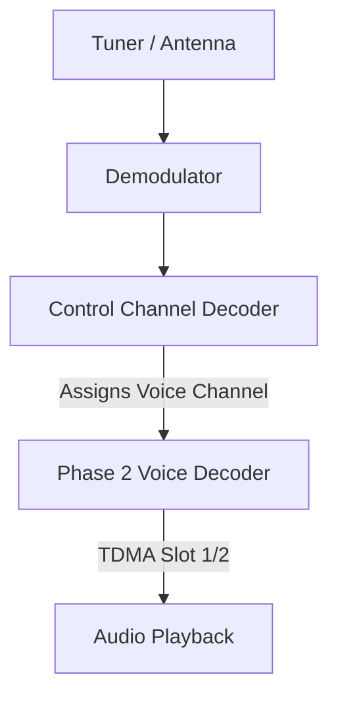

## Goal
Setup and configure P25 Phase 2 systems to monitor digital trunked public safety networks.

## Step-by-Step Configuration
1. Open the **Playlist Editor** from the main toolbar.
2. Select the **Channels** tab and click **New Channel**.
3. Choose **P25 Phase 2** as the system type.
4. Enter a recognizable **System Name**.
5. Input the primary **Control Channel** frequency for your local system.
6. (Optional) Set a **NAC Override** if you only want to process traffic from a specific Network Access Code.
7. Click **Save** and start the channel from the main channels list.

## P25 Signal Flow

## Setup Components
| Component | Function |
|---|---|
| **System Name** | The recognizable alias for your P25 Phase 2 system. |
| **Control Channel** | The primary frequency used for system trunking assignments. |
| **NAC Override** | Forces the decoder to only process traffic from a specific Network Access Code. |
