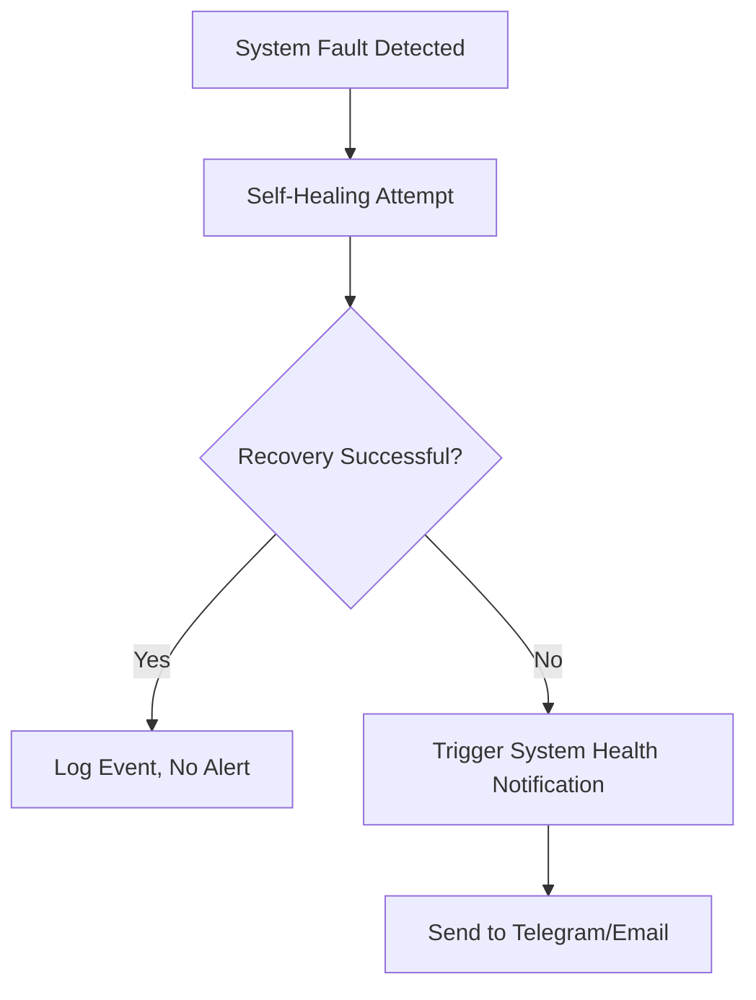

## Goal
**System Health Notifications** alert operators when SDRTrunk detects degraded health in tuners, streams, or audio outputs.

# System Health Notifications

SDRTrunk Kennebec can alert you the moment something goes wrong with your hardware or the application itself. Alerts are sent automatically after the built-in self-healing logic has attempted a recovery, so you only hear about problems that require your attention.

## Step-by-Step

1. In the menu bar, go to **View** → **User Preferences**.
2. Select **Notifications** in the left sidebar of the **User Preferences** panel.
3. Configure your **Telegram** or **Email / SMTP** settings.
4. Add a recipient and enable the **System Alerts** and/or **Hardware Alerts** toggles.

### Workflow Benefit

## Component Map

* **Telegram Bot Token:** Your unique token for sending messages via a Telegram bot.
* **Telegram Chat ID:** The destination chat or group ID for Telegram alerts.
* **SMTP Host / Port:** Server settings for sending email alerts.
* **Add Recipient:** Create a new notification routing rule for specific alert categories.
