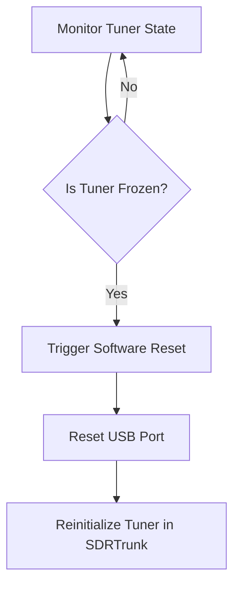

# Tuner Self Healing

## Goal
Understand how the Tuner Self-Healing feature automatically revives frozen tuners to ensure continuous operation.

## Overview
The Tuner Self-Healing feature actively monitors the USB connection states of RTL-SDR and HackRF controllers. If it detects a crash or lockup, it gracefully resets the USB port using native Java libraries to resume decoding.

## Component Map

* **Watchdog Service:** The background task that monitors tuner health.
* **USB Port Reset:** The mechanism used to revive a frozen device via standard LibUSB calls.
* **Status Log:** An output trace of recovery events for diagnostic review.

## Logic Flow

## Step-by-Step Configuration

*This feature requires no manual configuration inside the SDRTrunk UI. The watchdog script operates autonomously in the background.*

1. **Verify Execution:** This feature runs automatically. No external scripts or administrative privileges are needed.
2. **Monitor Logs:** Check the system logs periodically for recovery events.
