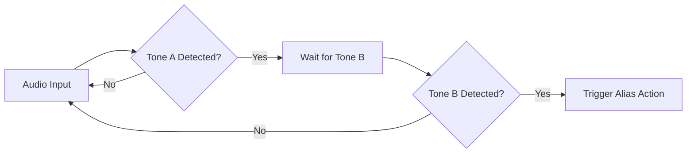

## Goal
Configure Two-Tone aliases to trigger automated alerts when specific audio tones are detected.

## Step-by-Step Configuration
1. Open the **Playlist Editor** from the main toolbar.
2. Select the **Aliases** tab and create a new alias or edit an existing one.
3. Scroll down to the **Two-Tone Setup** configuration card.
4. Enable Two-Tone processing for this alias.
5. Input your exact **Tone A** and **Tone B** frequencies (in Hz).
6. Set the **Tolerance** to allow for slight frequency deviations.
7. Configure the **Hold Time** to keep the alert active after the tones stop.
8. Click **Save** and verify the alias is active in the main interface.

## Two-Tone Trigger Flow

## Alias Configuration Components
| Component | Function |
|---|---|
| **Tone A Frequency** | The first frequency in the two-tone pair (in Hz). |
| **Tone B Frequency** | The second frequency in the two-tone pair (in Hz). |
| **Tolerance** | The acceptable deviation (in Hz) from the exact tone frequency. |
| **Hold Time** | How long the system should maintain the alert state after triggering. |
