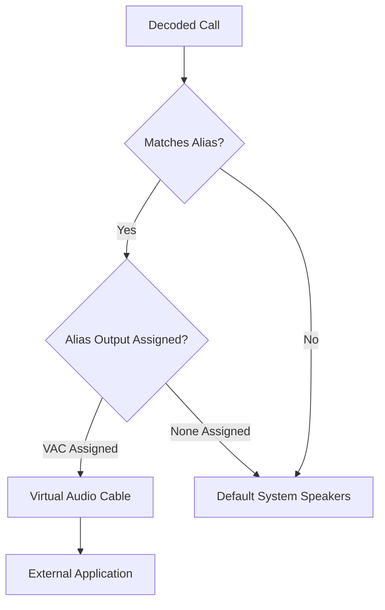

# Virtual Audio Cable Routing

## Goal
Route isolated audio from specific talkgroups or radio IDs into external applications using Virtual Audio Cables (VAC).

## Audio Routing Flow

## Component Map

* **Alias Editor:** The primary location to assign specific audio output devices for talkgroups.
* **Audio Output Device Dropdown:** Located inside the alias editor; lists all system speakers and installed VACs.

## Step-by-Step Configuration

1. **Install a VAC Driver:** First, install third-party VAC software (e.g., VB-Cable for Windows, BlackHole for macOS, or PulseAudio for Linux).
2. **Open Alias Editor:** Navigate to **Playlist Editor -> Aliases**.
3. **Select Target Alias:** Choose the alias you want to route (e.g., Fire Dispatch).
4. **Assign the Cable:** In the alias properties, locate the **Audio output device** dropdown and select your installed VAC.

> **Note:** Assigning a VAC effectively mutes the default system speakers for the selected talkgroup.

5. **Configure External App:** Open your external application (e.g., TwoToneDetect, OBS Studio) and set its Input/Microphone device to the same VAC.

> **Tip:** You can assign multiple talkgroups to output to the same Virtual Audio Cable for aggregated output feeds.
