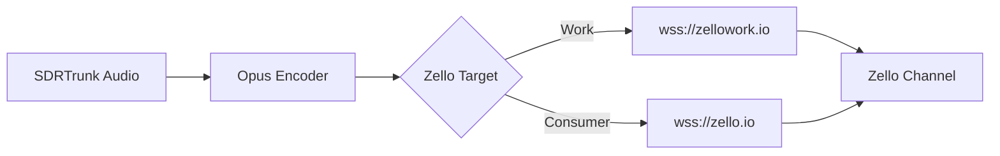

# Zello Integration

## Goal
Learn how to stream decoded radio audio directly into Zello channels over a WebSocket connection for easy remote monitoring.

## Zello Integration Logic

## Component Map

* **Network Name:** Required only for Zello Work (e.g., your subdomain).
* **Auth Token:** Required only for Zello Consumer (JWT token from the Zello developer portal).
* **Timing Parameters:** Stream Guard, Pause Time, and Relaxation Time used to fine-tune transmission gaps and prevent clipping.
* **Verbose Logging:** Enable this to generate detailed WebSocket and Opus encoding diagnostics in your logs.

## Step-by-Step Configuration

1. **Obtain Credentials:** Gather your Zello Work channel details or generate a Zello Consumer Auth Token.
2. **Open Streaming Editor:** Navigate to **View -> Streaming**.
3. **Add Broadcaster:** Click the **+** button and select either **Zello Work** or **Zello Consumer**.
4. **Configure Details:** Enter the required Username, Password, Channel, and (if applicable) Network Name or Auth Token.
5. **Enable and Save:** Check the **Enabled** box and click **Save**. SDRTrunk Kennebec will handle the audio encoding and transmission.

> **Warning:** You must obtain a Zello Consumer Auth Token from the Zello Developer Portal if connecting to standard (non-work) networks.
> **Note:** Audio encoding to Opus format happens automatically without user intervention.
